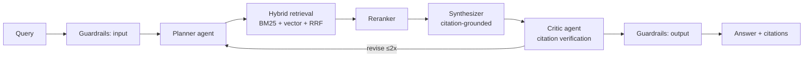

# Agentic RAG

Provider-agnostic agentic RAG reference system — multi-agent orchestration, hybrid retrieval, guardrails, and published LLM-as-judge evals. Built to demonstrate production RAG engineering end to end: not a demo, a reference.

**Status: private build phase — target public launch v0.1.0 on August 30, 2026.**

## Why This Exists

Thousands of RAG demos exist. Almost none publish evaluation results, run agentic and vanilla pipelines side by side, or treat guardrails and observability as first-class. This repo does all four, using public NIST publications as the corpus (SP 800-53r5, SP 800-171, AI RMF, FIPS 199/200).

## Planned Architecture



- **Providers:** Claude, GPT, Gemini, Ollama (local/air-gap path) behind one adapter protocol
- **Retrieval:** BM25 (SQLite FTS5) + FAISS vectors, reciprocal rank fusion, reranking
- **Agents:** LangGraph planner → retriever → synthesizer → critic loop
- **Evals:** golden dataset, retrieval metrics (recall@k, MRR, nDCG), LLM-as-judge (faithfulness, relevance, citation accuracy) with human calibration
- **Guardrails:** PII detection in/out, prompt-injection screening, refusal policy, audit log
- **Observability:** OpenTelemetry traces, per-request token/cost/latency

## Build Roadmap

| Week | Dates (2026) | Theme | Plan |
|------|--------------|-------|------|
| 1 | Jul 6 – Jul 12 | Foundations: scaffold, provider adapters, ingestion | [week-01](docs/plan/week-01.md) |
| 2 | Jul 13 – Jul 19 | Hybrid retrieval core + golden dataset v1 | [week-02](docs/plan/week-02.md) |
| 3 | Jul 20 – Jul 26 | Citation-grounded generation + reranking | [week-03](docs/plan/week-03.md) |
| 4 | Jul 27 – Aug 2 | Eval harness + first benchmark tables | [week-04](docs/plan/week-04.md) |
| 5 | Aug 3 – Aug 9 | LangGraph agent loop, agentic vs vanilla evals | [week-05](docs/plan/week-05.md) |
| 6 | Aug 10 – Aug 16 | Guardrails, refusal policy, audit logging | [week-06](docs/plan/week-06.md) |
| 7 | Aug 17 – Aug 23 | Observability, API hardening, Docker | [week-07](docs/plan/week-07.md) |
| 8 | Aug 24 – Aug 30 | Launch: docs, demo, final benchmarks, v0.1.0 public | [week-08](docs/plan/week-08.md) |

## Launch Success Criteria

- [ ] Benchmark table in README: ≥3 providers × ≥3 retrieval configs, retrieval + generation metrics
- [ ] Agentic vs vanilla RAG comparison with measured deltas
- [ ] CI green: ruff + pytest (≥80% coverage on core modules) + working quickstart
- [ ] Quickstart to first cited answer in under 5 minutes (Ollama path requires no API keys)
- [ ] Guardrail test suite passing; audit log documented
- [ ] Mermaid architecture diagram + demo recording in README

## Development Setup

Requires Python 3.11+ and [uv](https://docs.astral.sh/uv/). For the zero-cost local
path, install [Ollama](https://ollama.com) and pull the default models:
`ollama pull llama3.1:8b && ollama pull nomic-embed-text`.

```bash
git clone https://github.com/uehlingeric/agentic-rag.git
cd agentic-rag
make install          # uv venv + editable install with dev extras
make test             # unit tests (no network, no API keys)
make lint             # ruff + mypy

cp .env.example .env  # optional: add API keys for cloud providers
uv run agentic-rag ingest                    # download + chunk the NIST corpus
uv run agentic-rag chat "hello" --provider ollama
```

Live provider smoke tests (require keys / a running Ollama): `make test-live`.

## Guardrails

Every question runs through a safety sandwich by default — input PII/injection scan →
pipeline → output PII scan → schema-versioned audit record. The design is deliberately
honest: injection screening is a documented mitigation, not a solve, and the published
red-team catch rate (30/30 expect-catch cases, 7 annotated known misses) reflects that.
Guardrails add **p50 0.16 ms** on the local path and block **0 of 50** clean golden
questions. See [docs/guardrails.md](docs/guardrails.md), the audit schema in
[docs/audit-log.md](docs/audit-log.md), and the rationale in
[ADR-008](docs/adr/008-guardrails-design.md).

```bash
uv run agentic-rag ask "What does control AC-2 require?" --provider ollama
uv run agentic-rag ask "My SSN is 123-45-6789, what does AC-2 require?" --provider ollama
#   → blocked by the input guardrail (refusal_reason: input_pii)
make verify-guardrails   # false-positive rate, overhead p50/p95, red-team catch rate
```

## Docker: the whole stack, no keys

`make demo` (or `docker compose up`) runs API + Ollama + Jaeger and ends at cited
answers with zero cloud dependencies. First boot pulls ~5 GB of Ollama models and
ingests + indexes the NIST corpus — allow up to 30 minutes on broadband; subsequent
boots are seconds.

```bash
make demo   # compose up, wait for readiness, one cited answer via the API
curl -s -X POST localhost:8000/ask \
  -H "Authorization: Bearer local-dev-token" \
  -H "Content-Type: application/json" \
  -d '{"question": "What does control AC-2 require?", "pipeline": "agentic"}'
open http://localhost:16686   # Jaeger: the request's full span tree
```

CI smokes the same image with a deterministic stub provider over a committed
fixture corpus (`docker compose --profile smoke up api-smoke`) — no models, no
egress.

## API & Observability

`agentic-rag serve` hosts the same library the CLI uses: `POST /ask`
(vanilla/agentic, SSE streaming), `GET /search`, `GET /stats`, `GET /health`, with
static bearer auth, per-token rate limiting, and RFC 9457 problem+json errors.
Refusals are 200 responses keyed by `refusal_reason` — the guardrail worked, that's
not an error. Guardrails cannot be bypassed over HTTP.

Every pipeline stage emits OpenTelemetry spans (token, cost, chunk-count, verdict
attributes), and every request lands one row in a SQLite metrics ledger that
`agentic-rag stats` (or `GET /stats`) aggregates by provider/model/day/source —
including eval runs, so "what did this project cost" is one query. Span taxonomy
and the degradation playbook: [docs/observability.md](docs/observability.md);
design rationale: [ADR-009](docs/adr/009-observability-api-packaging.md).

## License

MIT — see [LICENSE](LICENSE).
