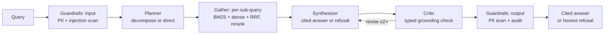
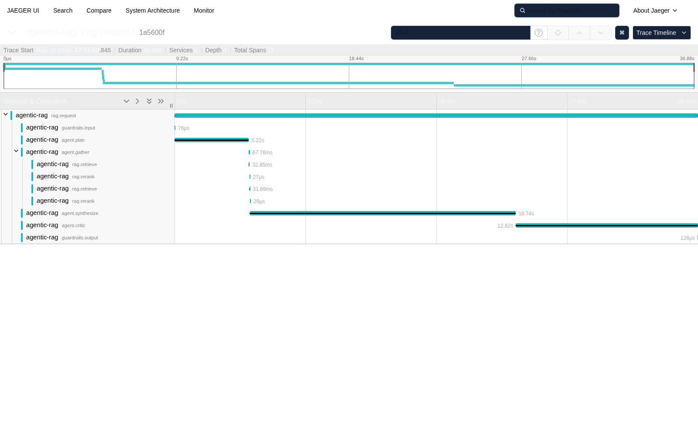

# Agentic RAG

Provider-agnostic agentic RAG reference system — planner/critic agent loop, hybrid
retrieval, always-on guardrails, and **published LLM-as-judge benchmarks** over a NIST
security-controls corpus. Built end to end in 8 planned weeks (the plans are in the
repo); every headline claim links to a committed eval run.

[](https://github.com/uehlingeric/agentic-rag/actions/workflows/ci.yml)
[](https://github.com/uehlingeric/agentic-rag/actions/workflows/codeql.yml)
[](pyproject.toml)
[](LICENSE)
[](https://github.com/uehlingeric/agentic-rag/releases)


## What it does

Ask a question about the corpus (NIST SP 800-53r5, SP 800-171r3, AI RMF, FIPS 199/200);
get a citation-grounded answer or an honest refusal — through either pipeline:



- **Two pipelines, same contract** — vanilla (retrieve → synthesize) and agentic
  (LangGraph planner → gather → synthesize → critic loop), compared head-to-head in the
  published benchmark.
- **Four providers behind one adapter** — Anthropic (API/Bedrock), Google (API/Vertex),
  OpenAI, Ollama; the local path needs no keys and no egress.
- **Hybrid retrieval** — SQLite FTS5 BM25 + FAISS dense vectors fused with reciprocal
  rank fusion; optional LLM/cross-encoder rerank.
- **Always-on guardrails** — input/output PII scans, prompt-injection screening,
  per-entity refusal policy, schema-versioned audit log. Non-bypassable over HTTP.
- **Evals as a first-class citizen** — golden dataset, retrieval metrics, cross-judge
  LLM-as-judge scoring with a published calibration study, committed benchmark runs.
- **Observability** — an OpenTelemetry span per stage with token/cost attributes, plus a
  SQLite metrics ledger (`agentic-rag stats` answers "what did this project cost").

## Benchmarks

Full matrix (3 providers × 4 retrieval configs × both pipelines, guardrails on,
judge.v2, dataset v2) in [docs/benchmarks.md](docs/benchmarks.md):

Headline (hybrid retrieval + LLM rerank, the canonical config; 1–5 rubric, judge
never scores its own provider):

| Provider | Pipeline | Faithfulness | Relevance | Citation acc. | False refusal | p50 latency |
|----------|----------|--------------|-----------|---------------|---------------|-------------|
| anthropic (sonnet-4-6) | vanilla | 5.00 | 5.00 | 5.00 | 0.16 | 17.9 s |
| anthropic (sonnet-4-6) | **agentic** | 5.00 | 4.94 | 5.00 | **0.08** | 34.1 s |
| google (gemini-3.5-flash) | vanilla | 4.80 | 4.63 | 4.90 | 0.21 | 4.2 s |
| google (gemini-3.5-flash) | **agentic** | 4.78 | 4.66 | 4.84 | **0.16** | 7.0 s |
| ollama (llama3.1:8b) | vanilla | 3.00 | 3.03 | 3.00 | 0.16 | 9.2 s |
| ollama (llama3.1:8b) | agentic | 2.26 | 2.88 | 2.03 | 0.11 | 18.5 s |

**The measured story:** the agent loop cuts cloud-provider false refusals in every
retrieval config (anthropic mean 0.28 → 0.18, google 0.37 → 0.26, largest gains on
the weakest retriever) while rubric scores hold within 0.06 — at ~2× generation
cost and latency. The same loop makes the local 8B model *worse* on every rubric
dimension: agentic pipelines amplify model quality, in both directions. Guardrails
were on for the entire run: 0 of 1,104 answers tripped them.

Methodology, judge-bias caveats, and every table: [docs/benchmarks.md](docs/benchmarks.md) ·
[docs/judge-calibration.md](docs/judge-calibration.md) ·
[docs/limitations.md](docs/limitations.md).

## Quickstart (no API keys)

Requires Python 3.11+, [uv](https://docs.astral.sh/uv/), and [Ollama](https://ollama.com).

```bash
ollama pull llama3.1:8b && ollama pull nomic-embed-text

git clone https://github.com/uehlingeric/agentic-rag.git
cd agentic-rag
make install                                 # uv venv + editable install
uv run agentic-rag ingest                    # download + chunk the NIST corpus
uv run agentic-rag index                     # build the BM25 + dense indexes
uv run agentic-rag ask "What does control AC-2 require?" --provider ollama
uv run agentic-rag ask "How does the AI RMF definition of risk relate to the impact levels in FIPS 199?" --provider ollama --agentic
```

Cloud providers: `cp .env.example .env`, add a key (or use Bedrock/Vertex credential
chains), pass `--provider anthropic|google|openai`.

### Docker: the whole stack

`make demo` (or `docker compose up`) runs API + Ollama + Jaeger and ends at a cited
answer with zero cloud dependencies. First boot pulls ~5 GB of models and builds the
index — allow up to 30 minutes on broadband; subsequent boots are seconds.

```bash
make demo
curl -s -X POST localhost:8000/ask \
  -H "Authorization: Bearer local-dev-token" \
  -H "Content-Type: application/json" \
  -d '{"question": "What does control AC-2 require?", "pipeline": "agentic"}'
open http://localhost:16686   # Jaeger: the request's full span tree
```

CI smokes the same image with a deterministic stub provider over a committed fixture
corpus (`docker compose --profile smoke up api-smoke`) — no models, no egress.

## Guardrails

Every question runs through a safety sandwich by default — input PII/injection scan →
pipeline → retrieved-content scan → output PII scan → audit record:

| Check (committed run) | Result |
| --- | --- |
| Red-team expect-catch cases | **30/30 caught** |
| Documented known misses (multilingual, homoglyph, leetspeak, split, social) | 7, annotated |
| False positives on 50 clean golden questions (input) | 0 |
| False positives on 210 benchmark answers (output) | 0 |
| Overhead, full scan (regex path) | **p50 0.16 ms** / p95 0.55 ms |

The design is deliberately honest: injection screening is a documented mitigation, not a
solve. Details: [docs/guardrails.md](docs/guardrails.md) ·
[docs/audit-log.md](docs/audit-log.md) · [ADR-008](docs/adr/008-guardrails-design.md).

```bash
uv run agentic-rag ask "My SSN is 123-45-6789, what does AC-2 require?" --provider ollama
#   → blocked by the input guardrail (refusal_reason: input_pii)
make verify-guardrails   # false-positive rate, overhead, red-team catch rate — no cost
```

## API & observability

`agentic-rag serve` hosts the same library the CLI uses: `POST /ask` (vanilla/agentic,
SSE streaming), `GET /search`, `GET /stats`, `GET /health` — static bearer auth,
per-token rate limits, RFC 9457 problem+json errors. Refusals are 200s keyed by
`refusal_reason`: the guardrail worked; that's not an error.



Span taxonomy and the degradation playbook: [docs/observability.md](docs/observability.md) ·
[ADR-009](docs/adr/009-observability-api-packaging.md).

## How it was built

An 8-week plan, executed and left in the history deliberately — plans in
[docs/plan/](docs/plan/), decisions in [docs/adr/](docs/adr/), weekly review artifacts in
[docs/reviews/](docs/reviews/):

| Week | Theme | Week | Theme |
|------|-------|------|-------|
| 1 | Scaffold, provider adapters, ingestion | 5 | LangGraph agent loop, agentic-vs-vanilla evals |
| 2 | Hybrid retrieval + golden dataset | 6 | Guardrails, refusal policy, audit log |
| 3 | Cited generation + reranking | 7 | OTel, FastAPI service, Docker |
| 4 | Eval harness, judge calibration, first benchmark | 8 | Final benchmark, docs, v0.1.0 |

Honest scope statement: [docs/limitations.md](docs/limitations.md).

## License

MIT — see [LICENSE](LICENSE).
