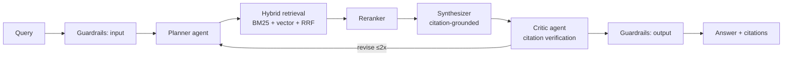

# Agentic RAG

Provider-agnostic agentic RAG reference system — multi-agent orchestration, hybrid retrieval, guardrails, and published LLM-as-judge evals. Built to demonstrate production RAG engineering end to end: not a demo, a reference.

**Status: private build phase — target public launch v0.1.0 on August 30, 2026.**

## Why This Exists

Thousands of RAG demos exist. Almost none publish evaluation results, run agentic and vanilla pipelines side by side, or treat guardrails and observability as first-class. This repo does all four, using public NIST publications as the corpus (SP 800-53r5, SP 800-171, AI RMF, FIPS 199/200).

## Planned Architecture

- **Providers:** Claude, GPT, Gemini, Ollama (local/air-gap path) behind one adapter protocol
- **Retrieval:** BM25 (SQLite FTS5) + FAISS vectors, reciprocal rank fusion, reranking
- **Agents:** LangGraph planner → retriever → synthesizer → critic loop
- **Evals:** golden dataset, retrieval metrics (recall@k, MRR, nDCG), LLM-as-judge (faithfulness, relevance, citation accuracy) with human calibration
- **Guardrails:** PII detection in/out, prompt-injection screening, refusal policy, audit log
- **Observability:** OpenTelemetry traces, per-request token/cost/latency

## Build Roadmap

| Week | Dates (2026) | Theme | Plan |
|------|--------------|-------|------|
| 1 | Jul 6 – Jul 12 | Foundations: scaffold, provider adapters, ingestion | [week-01](docs/plan/week-01.md) |
| 2 | Jul 13 – Jul 19 | Hybrid retrieval core + golden dataset v1 | [week-02](docs/plan/week-02.md) |
| 3 | Jul 20 – Jul 26 | Citation-grounded generation + reranking | [week-03](docs/plan/week-03.md) |
| 4 | Jul 27 – Aug 2 | Eval harness + first benchmark tables | [week-04](docs/plan/week-04.md) |
| 5 | Aug 3 – Aug 9 | LangGraph agent loop, agentic vs vanilla evals | [week-05](docs/plan/week-05.md) |
| 6 | Aug 10 – Aug 16 | Guardrails, refusal policy, audit logging | [week-06](docs/plan/week-06.md) |
| 7 | Aug 17 – Aug 23 | Observability, API hardening, Docker | [week-07](docs/plan/week-07.md) |
| 8 | Aug 24 – Aug 30 | Launch: docs, demo, final benchmarks, v0.1.0 public | [week-08](docs/plan/week-08.md) |

## Launch Success Criteria

- [ ] Benchmark table in README: ≥3 providers × ≥3 retrieval configs, retrieval + generation metrics
- [ ] Agentic vs vanilla RAG comparison with measured deltas
- [ ] CI green: ruff + pytest (≥80% coverage on core modules) + working quickstart
- [ ] Quickstart to first cited answer in under 5 minutes (Ollama path requires no API keys)
- [ ] Guardrail test suite passing; audit log documented
- [ ] Mermaid architecture diagram + demo recording in README

## License

MIT — see [LICENSE](LICENSE).
